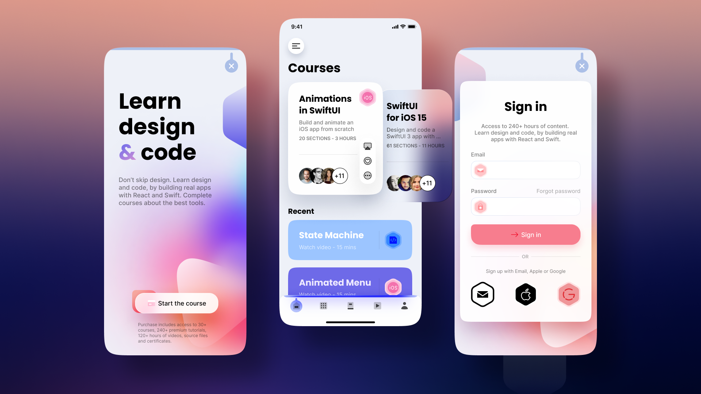

# Animated Onboarding, Sign-in, Home Page with Rive and Flutter

This starter mobile Flutter app provides beautifully animated onboarding, login, and home pages using Rive animations. 

## Features

- **Animated Onboarding**: Engage users with an attractive onboarding process.
- **Login Screen**: Smooth and stylish sign-in experience.
- **Home Page**: A dynamic and interactive home screen.

## Screenshots




## Fonts

This project uses the **Poppins** font. You can download it [here](https://fonts.google.com/specimen/Poppins).

## Setup

### Android Configuration

Ensure that your `ndkVersion` in `android/app/build.gradle` is set to:

```gradle
ndkVersion "25.1.8937393"
```

## Getting Started

To get started with this project, follow these steps:

1. **Clone the repository**:
    ```sh
    git clone https://github.com/your-username/Animated-Onboarding-Sign-in-Home-page-with-Rive-and-Flutter.git
    ```
2. **Navigate to the project directory**:
    ```sh
    cd Animated-Onboarding-Sign-in-Home-page-with-Rive-and-Flutter
    ```
3. **Install dependencies**:
    ```sh
    flutter pub get
    ```
4. **Run the app**:
    ```sh
    flutter run
    ```

## Contribution

Contributions are welcome! Please feel free to submit a pull request or open an issue.

## License

This project is licensed under the MIT License - see the [LICENSE](LICENSE) file for details.
